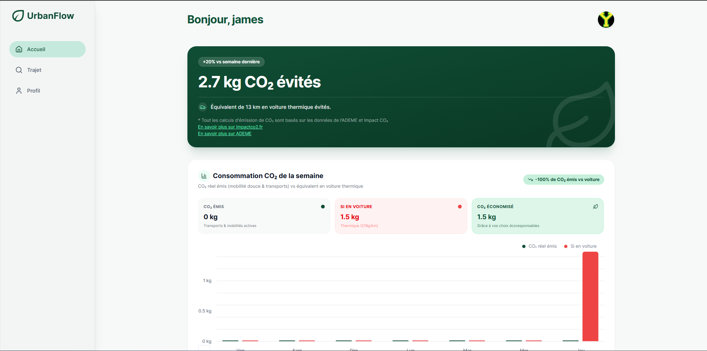
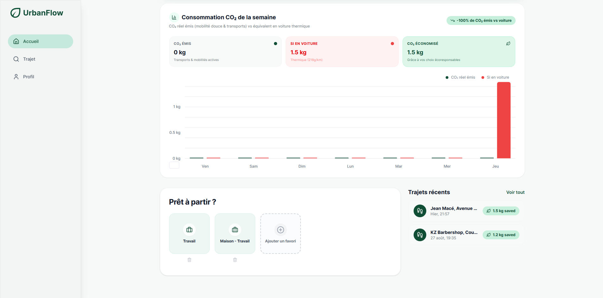
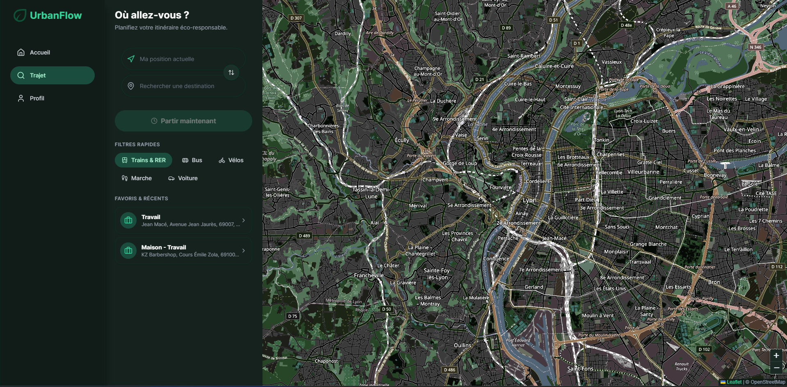
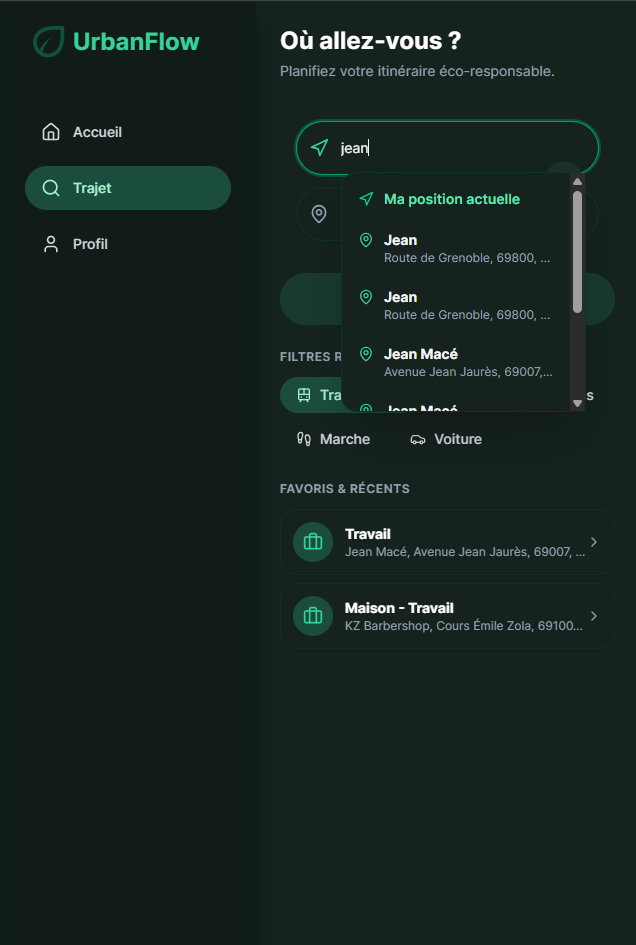
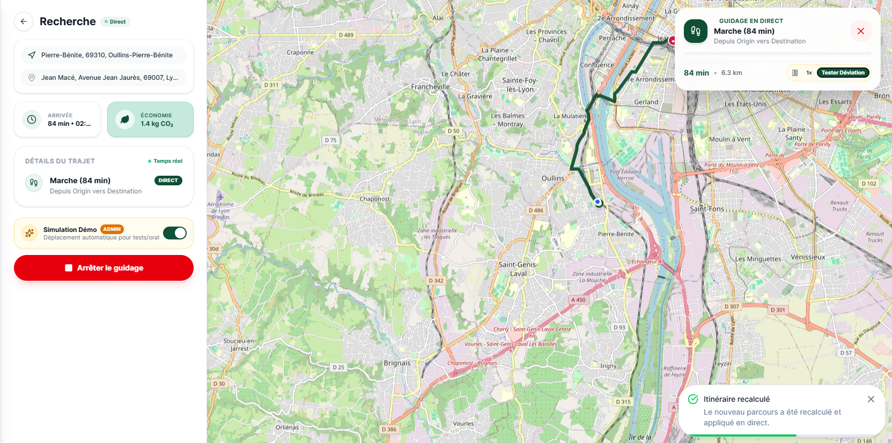
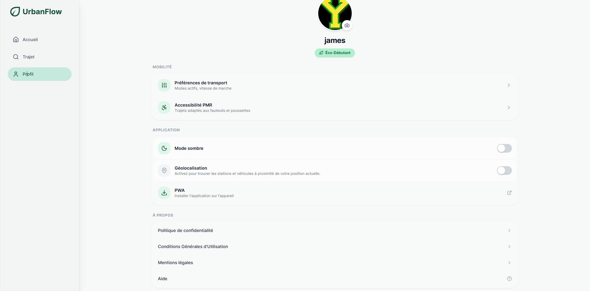
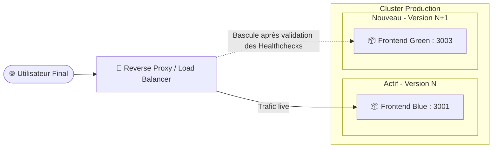

# Urban Flow — Frontend (Nuxt 4 / Vue 3)

<p align="center">
  
</p>

<p align="center">
  <strong>Application Web Progressive (PWA) d'éco-mobilité et de calcul d'itinéraires multimodaux pour la Métropole de Lyon.</strong>
</p>

<p align="center">
  <a href="#-fonctionnalités-clés"></a>
  <a href="#-fonctionnalités-clés"></a>
  <a href="#-fonctionnalités-clés"></a>
  <a href="#-fonctionnalités-clés"></a>
  <a href="#-fonctionnalités-clés"></a>
  <a href="#-tests--qualité"></a>
</p>

---

## 📑 Sommaire

- [✨ Présentation](#-présentation--valeur-ajoutée)
- [📸 Galerie d'Écrans & Démonstrations](#-galerie-décrans--démonstrations)
- [🚀 Fonctionnalités Clés](#-fonctionnalités-clés)
- [🛠️ Stack Technique](#️-stack-technique)
- [📁 Structure du Projet](#-structure-du-projet)
- [⚙️ Prérequis & Variables d'Environnement](#️-prérequis--variables-denvironnement)
- [💻 Installation & Démarrage](#-installation--démarrage)
- [🧪 Tests & Qualité](#-tests--qualité)
- [🔄 Déploiement Blue / Green](#-déploiement-blue--green)
- [🛡️ Sécurité & SEO](#️-sécurité--seo)

---

## ✨ Présentation

**Urban Flow Frontend** est l'interface utilisateur de la plateforme éco-responsable de transport à Lyon. Elle permet aux usagers de planifier leurs déplacements en combinant tous les modes de transport doux et partagés (Métro, Tramway, Bus TCL, Vélo'v, trottinettes et marche), tout en mesurant avec précision les **émissions de CO₂ évitées** par rapport à l'usage d'un véhicule thermique individuel (selon les facteurs d'émission officiels de l'**ADEME**).

---

## 📸 Galerie d'Écrans & Démonstrations

### 1. Page d'Accueil & Graphique Hebdomadaire CO₂
```markdown



```

---

### 2. Mode Nuit & Adaptation Dynamique des Cartes Leaflet
```markdown

```

---

### 3. Recherche d'Itinéraire & Autocomplétion Photon Lyon
```markdown

```

---

### 4. Guidage en Direct & Alerte de Déviation (Turn-by-Turn)
```markdown

```
---

### 5. Profil Éco-Citoyen & Préférences de Mobilité
```markdown

```


---

## 🚀 Fonctionnalités Clés

- 🗺️ **Moteur d'Itinéraires Multimodaux** : Intégration en temps réel avec OpenTripPlanner (OTP) pour combiner transports en commun lyonnais (TCL), vélos et marche.
- 📍 **Autocomplétion Géographique Dédiée** : Recherche d'adresses ultra-rapide via l'API Photon, filtrée sur la bounding box et les codes postaux de la métropole lyonnaise (`69xxx`).
- 🧭 **Guidage Pas-à-Pas & Recalcul Automatique** : Surveillance de la position GPS avec détection automatique des déviations d'itinéraire et recalcul instantané.
- 🍃 **Éco-Indicateurs & Facteurs ADEME** : Calcul scientifique du CO₂ évité (218 g/km voiture) et projection sous forme de graphiques groupés interactifs via `nuxt-charts`.
- ⭐ **Favoris & Historique Synchronisé** : Gestion complète des adresses favorites et rejeu des trajets récents avec mini-cartes Leaflet.
- 🌗 **Mode Jour / Nuit Modulaire** : Composable réactif `useTheme`, persistance `localStorage`, détection automatique `prefers-color-scheme` et filtres cartographiques adaptés.
- 📱 **Progressive Web App (PWA)** : Installable sur mobile et desktop, icônes adaptatives et cache hors-ligne via `@vite-pwa/nuxt`.
- 🔍 **SEO & Rich Snippets** : Données structurées Schema.org (`WebApplication`, `Organization`), métadonnées OpenGraph, Twitter Cards et `sitemap.xml` dynamique.

---

## 🛠️ Stack Technique

- **Framework principal** : [Nuxt 4](https://nuxt.com/) (Mode hybride SSR / SPA)
- **Cœur applicatif** : [Vue 3](https://vuejs.org/) (Composition API, `<script setup>`, TypeScript strict)
- **Style & Design System** : [Tailwind CSS v4](https://tailwindcss.com/) & [@nuxt/ui](https://ui.nuxt.com/)
- **Cartographie & SIG** : [Leaflet](https://leafletjs.com/) via `@nuxtjs/leaflet` & Tuiles OpenStreetMap
- **Gestion d'état** : [Pinia](https://pinia.vuejs.org/) (Stores `geo`, `navigation`)
- **Visualisation de Données** : [nuxt-charts](https://github.com/romhnd/nuxt-charts) (`vue-chrts`)
- **Authentification & Données** : [@nuxtjs/supabase](https://supabase.nuxtjs.org/)
- **Iconographie** : [Lucide Icons](https://lucide.dev/) (`lucide-vue-next`)
- **Suite de Tests** : [Vitest](https://vitest.dev/) & [@vue/test-utils](https://test-utils.vuejs.org/)

---

## 📁 Structure du Projet

```text
front-urban-flow/
├── app/
│   ├── assets/
│   │   └── css/
│   │       └── main.css              # Thème Tailwind v4, styles sombres & filtres Leaflet
│   ├── components/
│   │   ├── auth/                     # Formulaires, bannières et boutons Google OAuth
│   │   ├── header/                   # En-têtes accueil et profil
│   │   ├── home/                     # Statistiques CO2, favoris, trajets récents, graphiques
│   │   ├── ui/                       # Composants atomiques (boutons, spinners, retours)
│   │   ├── DestinationSelector.vue   # Sélecteur de départ / arrivée avec inversion
│   │   ├── DetailTrajet.vue          # Vue détaillée avec timeline des correspondances
│   │   ├── NavigationBanner.vue      # Bandeau flottant de navigation Turn-by-Turn
│   │   ├── NavigationBar.vue         # Navbar desktop & Bottom bar mobile
│   │   ├── PhotonAutocomplete.vue    # Champ d'autocomplétion géocodé Lyon
│   │   ├── ThemeToggle.vue           # Switch interactif Jour / Nuit
│   │   └── mapLeafet.vue             # Composant cartographique Leaflet réactif
│   ├── composables/                  # Logique métier réutilisable (useTheme, useFavorites, ...)
│   ├── layouts/                      # Layouts standard, carte plein écran, juridique, auth
│   ├── pages/                        # Routes de l'application (index, trajet, profil, auth, ...)
│   ├── stores/                       # Stores Pinia (stores/geo.ts, stores/navigation.ts)
│   ├── types/                        # Interfaces TypeScript strictes (itinerary, favorite, photon)
│   └── utils/                        # Services HTTP, calculs d'émissions CO2 et validation
├── public/                           # Manifest PWA, sitemap.xml, robots.txt, assets statiques
├── test/                             # Tests unitaires Vitest
├── nuxt.config.ts                    # Configuration Nuxt, PWA, SEO, modules & Nitro
├── package.json                      # Dépendances et scripts npm
└── Dockerfile                        # Image de production multi-stage
```

---

## ⚙️ Prérequis & Variables d'Environnement

Créez un fichier `.env` à la racine de `front-urban-flow/` (ou utilisez les variables transmises par Docker Compose) :

```bash
# URL de l'API Gateway NestJS
NUXT_PUBLIC_URL_BACK=http://localhost:3002

# Instance Supabase Self-Hosted (Kong Gateway)
NUXT_PUBLIC_SUPABASE_URL=http://localhost:8000
NUXT_PUBLIC_SUPABASE_KEY=eyJhbGciOiJIUzI1NiIsInR5cCI6IkpXVCJ9...

# Moteurs géographiques
URL_PHOTON=https://photon.komoot.io
URL_BASE_OTP=http://localhost:8080
URL_OTP=http://localhost:8080/otp/routers/default/plan
```

---

## 💻 Installation & Démarrage

### 1. Installation des dépendances
```bash
npm install
```

### 2. Démarrage en mode développement
```bash
npm run dev
```
L'application est accessible sur [http://localhost:3000](http://localhost:3000).

### 3. Compilation pour la production
```bash
npm run build
npm run preview
```

---

## 🧪 Tests & Qualité

Le projet inclut une suite de tests unitaires automatisés validant les calculs de CO₂, la modélisation multimodale et la gestion des préférences :

```bash
# Lancement de la suite de tests unitaires
npm test

# Lancement des tests en mode exécution unique
npx vitest run

# Rapport de couverture de code
npx vitest run --coverage
```

---

## 🔄 Déploiement Blue / Green

L'architecture de production utilise une stratégie de déploiement **Blue / Green** permettant des mises à jour applicatives sans aucune interruption de service (*Zero-Downtime*) :



### Processus de déploiement :
1. **Build & Déploiement Green** : Le nouveau conteneur frontend est instancié sur un port isolé (environnement Green).
2. **Vérification automatique (Healthcheck)** : Les sondes vérifient le bon chargement des assets, de l'état Nuxt et la connectivité API.
3. **Bascule du trafic** : Le reverse proxy redirige instantanément le flux d'utilisateurs vers l'environnement Green.
4. **Rollback immédiat** : En cas d'anomalie détectée, le proxy conserve le ciblage sur l'environnement Blue sans impact client.

---

## 🛡️ Sécurité & SEO

- **Protection des données** : Conforme aux exigences du RGPD (géolocalisation traitée localement en direct, sans revente ni traçage publicitaire).
- **Sécurisation des accès** : Middlewares Nuxt d'authentification (`middleware/auth.ts`, `middleware/guest.ts`) vérifiant les sessions Supabase JWT.
- **Indexation contrôlée** : Balises `robots: noindex, nofollow` sur les espaces authentifiés (`/profil`, `/confirm`) et indexation prioritaire des pages vitrines et de calcul (`/`, `/trajet`).
